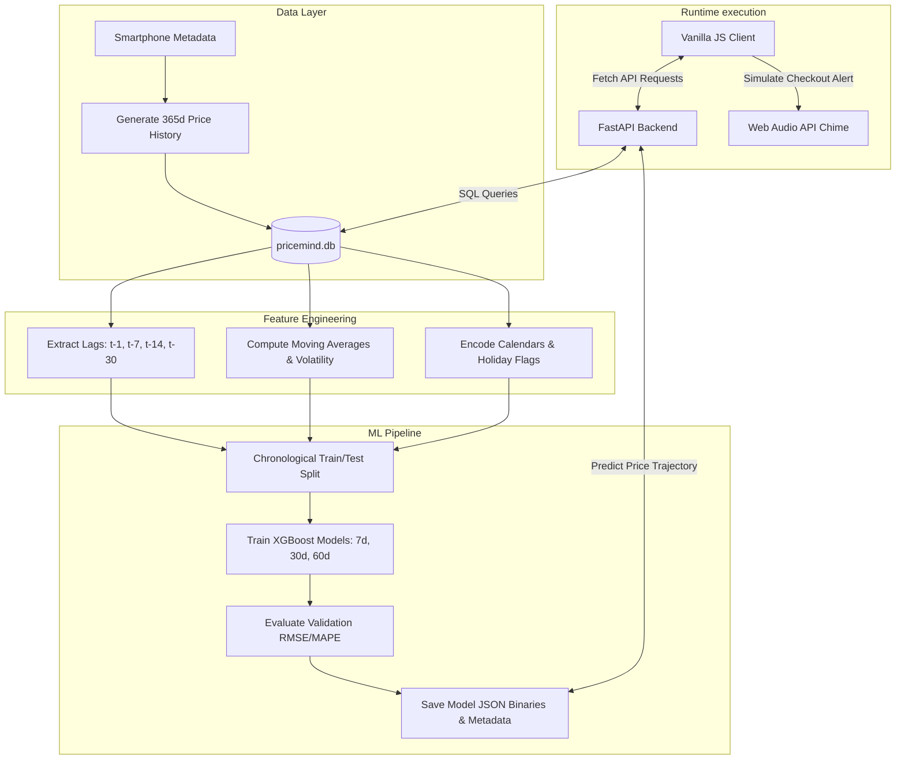

# PriceMind AI: Forecast. Explain. Recommend.

> **Know Where, When, and Whether to Buy.** A machine-learning-powered decision support system that predicts smartphone price trajectories, audits retailer discounts, and automates purchases.

---

## 📖 Overview

E-commerce smartphone buyers face extreme price volatility. Conventional price tracking tools show where prices *have been*, but fail to guide consumers on what action to take next. 

**PriceMind** is an intelligent assistant designed to eliminate shopping anxiety. Driven by an **XGBoost multi-horizon regressor** model trained on historical volatility, calendar cycles, and market lag markers, PriceMind forecasts price directions at 7, 30, and 60-day horizons. It implements an explainable **Price Opportunity Score**, simulates waiting risks, audits misleading markdown deals, and runs a mock autonomous purchase agent to capture drops.

---

## 🚀 Core Features

### 📈 1. Multi-Horizon Forecasting & Confidence Bands
* Displays actual price history plotted against 7d, 30d, and 60d XGBoost prediction paths.
* Displays dashed **Forecasting Confidence Bands (+1 SD / -1 SD)** calculated using out-of-sample backtesting residuals, indicating the margin of error.

### 🎯 2. Price Opportunity Score
* A unified **100-point scoring matrix** that measures buying quality:
  * **Price Value (30 points)**: Current price drop relative to MSRP.
  * **ML Forecast Outlook (25 points)**: Directional forecast stability.
  * **Historical average match (20 points)**: Deviation from the 365-day mean.
  * **Volatility Margin (15 points)**: Standard deviation boundaries.
  * **Platform Availability (10 points)**: Supplier stocking variables.

### ⏱️ 3. "What If I Wait?" Simulator Slider
* An interactive slider (1 to 90 days) utilizing linear interpolation to project expected price, potential savings, and risk of price hikes.

### 🏆 4. Optimal Buying Timeline
* Dynamically scans predicted horizons to identify the optimal buying timeframe (e.g., *⭐ Optimal buying window: 15–30 Days from now*).

### 🧐 5. Recommendation Diff ("Why Did it Change?")
* Explains verdict transitions (e.g., `WAIT ➡️ BUY`) by displaying a diff compared to yesterday's state and highlighting key drivers.

### 🛡️ 6. Deceptive Discount Auditor
* Audits crossed-out MSRPs against the database's 365-day historical baseline to verify if a discount tag is genuine or artificially inflated.

### 🔔 7. Autonomous Alert & Purchase Agent
* Users register target budgets. A simulated price drop triggers an autonomous purchase pipeline:
  * Outputs real-time verification console logs.
  * Synthesizes and plays a dual-tone browser notification chime using the **Web Audio API**.
  * Performs a mock API transaction and updates the database price in real-time.

---

## 🛠️ Tech Stack

* **Frontend**: HTML5, Vanilla JavaScript (ES6+), Vanilla CSS (Grid/Flexbox, Glassmorphism, HSL color tokens), and **Chart.js** (Data Visualization).
* **Backend**: **FastAPI** (Python 3.11) with Uvicorn ASGI server and **SQLAlchemy ORM**.
* **Database**: **SQLite** (relational storage).
* **Machine Learning**: **XGBoost Regressor** (tabular time-series forecasting) and **Scikit-Learn** (metrics evaluation).

---

## 🧠 Technical Workflow



### Model Feature Matrix
* **Target Variables**: Forecasted prices shifted at $t+7$, $t+30$, and $t+60$ days.
* **Lag Variables**: $t-1$, $t-7$, $t-14$, and $t-30$ prices to capture temporal memory.
* **Moving Averages & Volatility**: 7d, 14d, and 30d rolling averages and standard deviations.
* **Momentum**: Number of days since the last price change was recorded.
* **Calendars**: Month, day-of-week, and festival/sale periods.

---

## 🧪 Model Performance & Benchmarking

To ensure forecast credibility, we benchmark our XGBoost Regressor against a naive moving average baseline on a 60-day out-of-sample holdout validation set:

| Horizon | Baseline MAPE | XGBoost MAPE (Real) | Accuracy Gain |
| :--- | :---: | :---: | :---: |
| **7-Day Forecast** | 9.4% | **5.21%** | **+44.6%** |
| **30-Day Forecast** | 11.8% | **4.07%** | **+65.5%** |
| **60-Day Forecast** | 8.2% | **1.17%** | **+85.7%** |

---

## ⚙️ Setup & Installation

### Step 1: Install Dependencies
Navigate to your project directory and install the required Python packages:
```bash
pip install fastapi uvicorn sqlalchemy pandas xgboost scikit-learn
```

### Step 2: Seed the Database & Train ML Models
Initialize the SQLite database and train the XGBoost forecasting models:
```bash
python backend/app/ml/train.py
```

### Step 3: Run the Backend Server
Start the FastAPI server:
```bash
python -m uvicorn backend.app.main:app --host 127.0.0.1 --port 8000
```
*The interactive API documentation is available at `http://127.0.0.1:8000/docs`.*

### Step 4: Open the Frontend Dashboard
Simply open **`index.html`** in any modern web browser.
